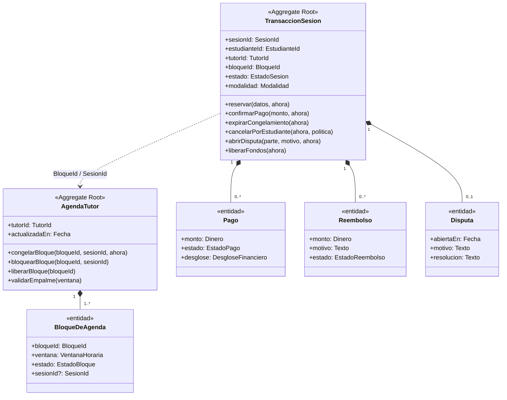

# Diagrama de clases: Capa de Dominio

```mermaid
classDiagram
    %% Capa de Dominio - Clases del proceso principal
    class TransaccionSesion {
        <<Aggregate Root>>
        +sesionId: SesionId
        +estudianteId: EstudianteId
        +tutorId: TutorId
        +bloqueId: BloqueId
        +estado: EstadoSesion
        +modalidad: Modalidad
        +reservar(datos, ahora)
        +confirmarPago(monto, ahora)
        +expirarCongelamiento(ahora)
        +cancelarPorEstudiante(ahora, politica)
        +abrirDisputa(parte, motivo, ahora)
        +liberarFondos(ahora)
    }

    class AgendaTutor {
        <<Aggregate Root>>
        +tutorId: TutorId
        +actualizadaEn: Fecha
        +congelarBloque(bloqueId, sesionId, ahora)
        +bloquearBloque(bloqueId, sesionId)
        +liberarBloque(bloqueId)
        +validarEmpalme(ventana)
    }

    class Pago {
        <<entidad>>
        +monto: Dinero
        +estado: EstadoPago
        +desglose: DesgloseFinanciero
    }

    class Reembolso {
        <<entidad>>
        +monto: Dinero
        +motivo: Texto
        +estado: EstadoReembolso
    }

    class Disputa {
        <<entidad>>
        +abiertaEn: Fecha
        +motivo: Texto
        +resolucion: Texto
    }

    class BloqueDeAgenda {
        <<entidad>>
        +bloqueId: BloqueId
        +ventana: VentanaHoraria
        +estado: EstadoBloque
        +sesionId?: SesionId
    }

    TransaccionSesion "1" *-- "0..*" Pago
    TransaccionSesion "1" *-- "0..*" Reembolso
    TransaccionSesion "1" *-- "0..1" Disputa

    TransaccionSesion ..> AgendaTutor : BloqueId / SesionId
    AgendaTutor "1" *-- "1..*" BloqueDeAgenda
```
