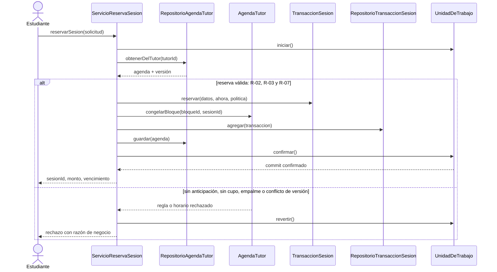

# Diagrama de secuencia: Reserva de sesión

```mermaid
sequenceDiagram
    actor Estudiante
    participant SRS as ServicioReservaSesion
    participant RAT as RepositorioAgendaTutor
    participant AT as AgendaTutor
    participant TS as TransaccionSesion
    participant RTS as RepositorioTransaccionSesion
    participant UoW as UnidadDeTrabajo

    Estudiante->>SRS: reservarSesion(solicitud)
    SRS->>UoW: iniciar()
    SRS->>RAT: obtenerDelTutor(tutorId)
    RAT-->>SRS: agenda + versión

    alt reserva válida: R-02, R-03 y R-07
        SRS->>TS: reservar(datos, ahora, politica)
        SRS->>AT: congelarBloque(bloqueId, sesionId)
        SRS->>RTS: agregar(transaccion)
        SRS->>RAT: guardar(agenda)
        SRS->>UoW: confirmar()
        UoW-->>SRS: commit confirmado
        SRS-->>Estudiante: sesionId, monto, vencimiento
    else sin anticipación, sin cupo, empalme o conflicto de versión
        AT-->>SRS: regla o horario rechazado
        SRS->>UoW: revertir()
        SRS-->>Estudiante: rechazo con razón de negocio
    end
```
