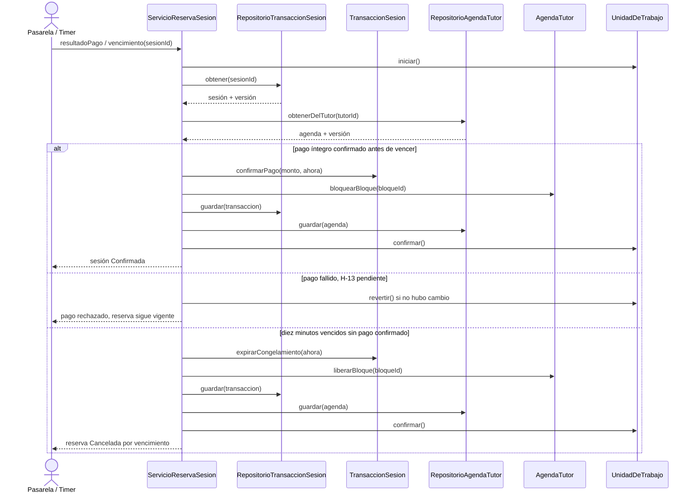

# Diagrama de secuencia: Confirmación de pago / vencimiento

```mermaid
sequenceDiagram
    actor PT as Pasarela / Timer
    participant SRS as ServicioReservaSesion
    participant RTS as RepositorioTransaccionSesion
    participant TS as TransaccionSesion
    participant RAT as RepositorioAgendaTutor
    participant AT as AgendaTutor
    participant UoW as UnidadDeTrabajo

    PT->>SRS: resultadoPago / vencimiento(sesionId)
    SRS->>UoW: iniciar()
    SRS->>RTS: obtener(sesionId)
    RTS-->>SRS: sesión + versión
    SRS->>RAT: obtenerDelTutor(tutorId)
    RAT-->>SRS: agenda + versión

    alt pago íntegro confirmado antes de vencer
        SRS->>TS: confirmarPago(monto, ahora)
        SRS->>AT: bloquearBloque(bloqueId)
        SRS->>RTS: guardar(transaccion)
        SRS->>RAT: guardar(agenda)
        SRS->>UoW: confirmar()
        SRS-->>PT: sesión Confirmada
    else pago fallido, H-13 pendiente
        SRS->>UoW: revertir() si no hubo cambio
        SRS-->>PT: pago rechazado, reserva sigue vigente
    else diez minutos vencidos sin pago confirmado
        SRS->>TS: expirarCongelamiento(ahora)
        SRS->>AT: liberarBloque(bloqueId)
        SRS->>RTS: guardar(transaccion)
        SRS->>RAT: guardar(agenda)
        SRS->>UoW: confirmar()
        SRS-->>PT: reserva Cancelada por vencimiento
    end
```
