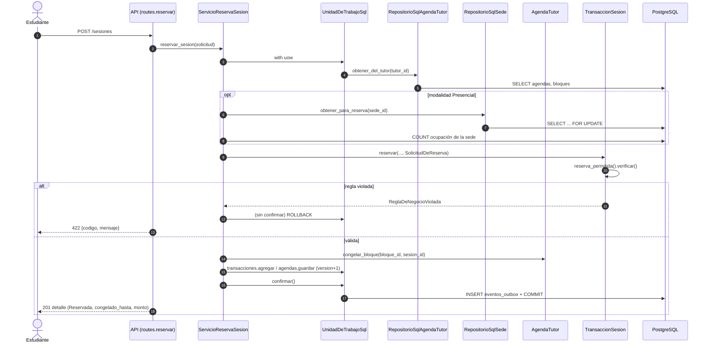
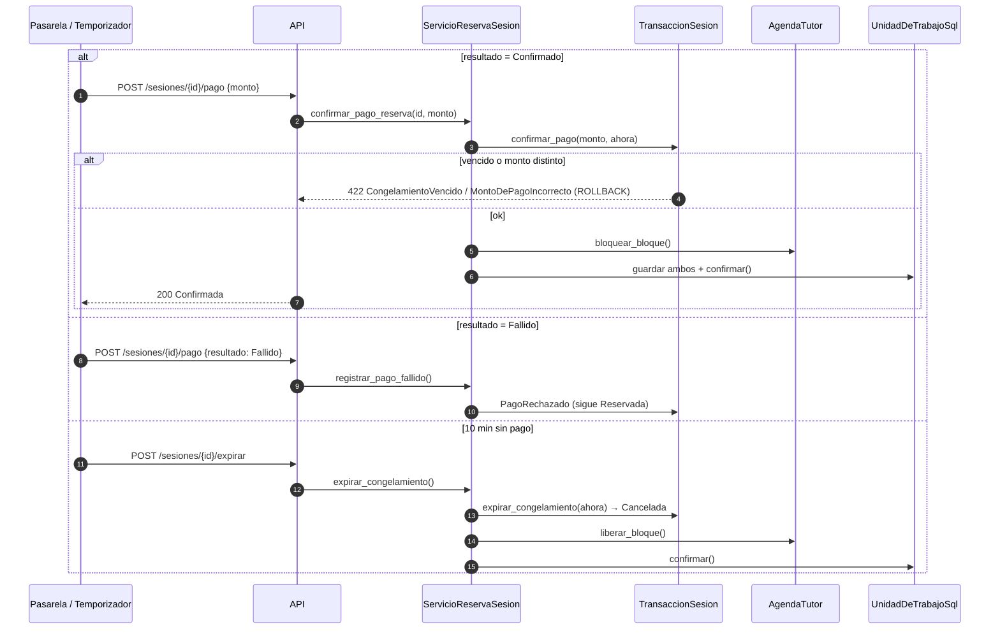
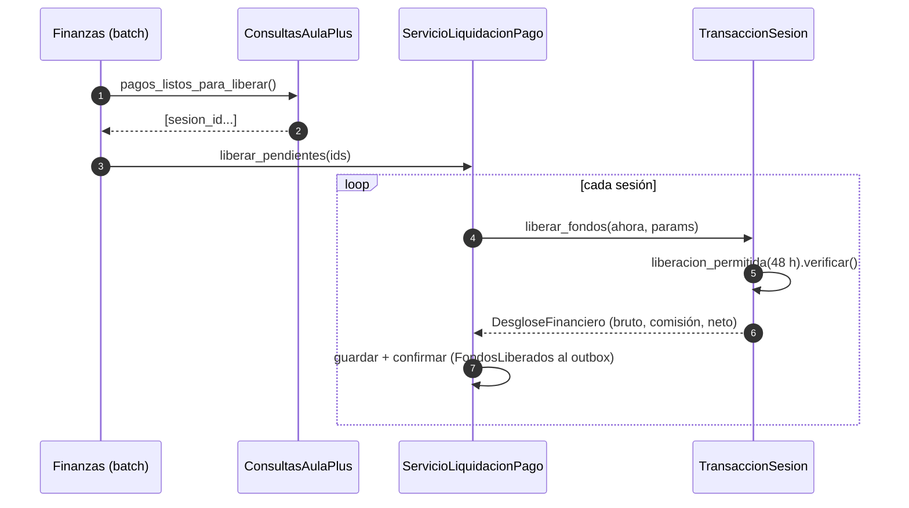

# Diagramas de secuencia (participantes = clases reales)

## CU-01 Reservar sesión

```mermaid
sequenceDiagram
  autonumber
  actor E as Estudiante
  participant API as API (routes.reservar)
  participant S as ServicioReservaSesion
  participant U as UnidadDeTrabajoSql
  participant RA as RepositorioSqlAgendaTutor
  participant RS as RepositorioSqlSede
  participant A as AgendaTutor
  participant T as TransaccionSesion
  participant DB as PostgreSQL

  E->>API: POST /sesiones
  API->>S: reservar_sesion(solicitud)
  S->>U: with uow
  U->>RA: obtener_del_tutor(tutor_id)
  RA->>DB: SELECT agendas, bloques
  opt modalidad Presencial
    S->>RS: obtener_para_reserva(sede_id)
    RS->>DB: SELECT ... FOR UPDATE
    S->>DB: COUNT ocupación de la sede
  end
  S->>T: reservar(..., SolicitudDeReserva)
  T->>T: reserva_permitida().verificar()
  alt regla violada
    T-->>S: ReglaDeNegocioViolada
    S->>U: (sin confirmar) ROLLBACK
    API-->>E: 422 {codigo, mensaje}
  else válida
    S->>A: congelar_bloque(bloque_id, sesion_id)
    S->>U: transacciones.agregar / agendas.guardar (version+1)
    S->>U: confirmar()
    U->>DB: INSERT eventos_outbox + COMMIT
    API-->>E: 201 detalle (Reservada, congelado_hasta, monto)
  end
```

## CU-02 Confirmar pago o vencer el congelamiento

```mermaid
sequenceDiagram
  autonumber
  participant P as Pasarela / Temporizador
  participant API as API
  participant S as ServicioReservaSesion
  participant T as TransaccionSesion
  participant A as AgendaTutor
  participant U as UnidadDeTrabajoSql

  alt resultado = Confirmado
    P->>API: POST /sesiones/{id}/pago {monto}
    API->>S: confirmar_pago_reserva(id, monto)
    S->>T: confirmar_pago(monto, ahora)
    alt vencido o monto distinto
      T-->>API: 422 CongelamientoVencido / MontoDePagoIncorrecto (ROLLBACK)
    else ok
      S->>A: bloquear_bloque()
      S->>U: guardar ambos + confirmar()
      API-->>P: 200 Confirmada
    end
  else resultado = Fallido
    P->>API: POST /sesiones/{id}/pago {resultado: Fallido}
    API->>S: registrar_pago_fallido()
    S->>T: PagoRechazado (sigue Reservada)
  else 10 min sin pago
    P->>API: POST /sesiones/{id}/expirar
    API->>S: expirar_congelamiento()
    S->>T: expirar_congelamiento(ahora) → Cancelada
    S->>A: liberar_bloque()
    S->>U: confirmar()
  end
```

## CU-05 Liberar pago al tutor

```mermaid
sequenceDiagram
  autonumber
  participant F as Finanzas (batch)
  participant Q as ConsultasAulaPlus
  participant S as ServicioLiquidacionPago
  participant T as TransaccionSesion
  F->>Q: pagos_listos_para_liberar()
  Q-->>F: [sesion_id...]
  F->>S: liberar_pendientes(ids)
  loop cada sesión
    S->>T: liberar_fondos(ahora, params)
    T->>T: liberacion_permitida(48 h).verificar()
    T-->>S: DesgloseFinanciero (bruto, comisión, neto)
    S->>S: guardar + confirmar (FondosLiberados al outbox)
  end
```
